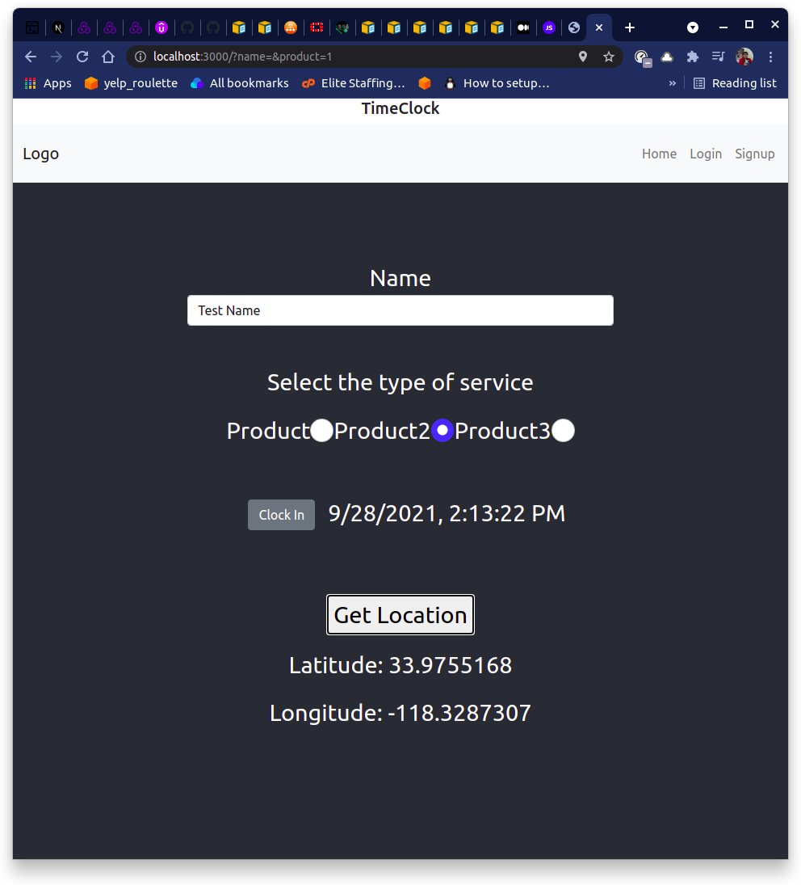

# Timeclock Sample

This project was bootstrapped with [Create React App](https://github.com/facebook/create-react-app).

A Timeclock form example written in React. This is the Frontend only. Form, Navbar and Coordinate components are stored in components folder. 

Uses the following libraries
* Bootstrap - for styling and creating components like NavBar
* Used Geolocated but switched to browser API to reduce extras - gives coordinates

This project would need a backend database written out, authentication, an admin panel, and to convert geolocation to an address.

## Resources
[Get Coordinates from browser](https://javascript.plainenglish.io/how-to-use-the-geolocation-api-in-your-react-app-54e87c9c6c94)

### `npm start`

Runs the app in the development mode.\
Open [http://localhost:3000](http://localhost:3000) to view it in the browser.

The page will reload if you make edits.\
You will also see any lint errors in the console.

### `npm test`

Launches the test runner in the interactive watch mode.\
See the section about [running tests](https://facebook.github.io/create-react-app/docs/running-tests) for more information.

### `npm run build`

Builds the app for production to the `build` folder.\
It correctly bundles React in production mode and optimizes the build for the best performance.

The build is minified and the filenames include the hashes.\
Your app is ready to be deployed!

See the section about [deployment](https://facebook.github.io/create-react-app/docs/deployment) for more information.

